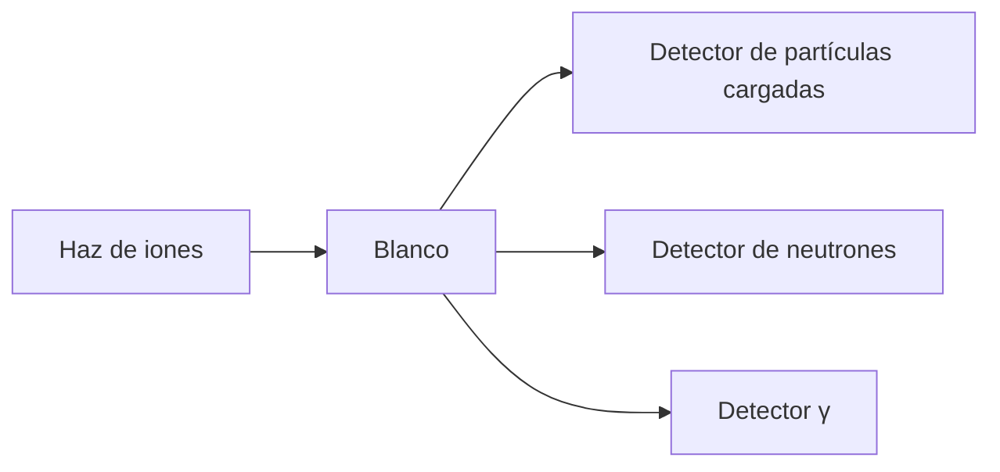

### **Unidad 5: Reacciones Nucleares**  
#### **1. Introducción: La Alquimia Nuclear Controlada**  
Las reacciones nucleares representan procesos transformativos donde núcleos atómicos interactúan, reorganizando su estructura para dar lugar a nuevos elementos o isótopos. A diferencia de los decaimientos espontáneos, estas reacciones son **inducidas por proyectiles energéticos** (neutrones, protones, partículas α, iones pesados) que superan la barrera coulombiana. Este campo es crucial para entender:  
- La síntesis de elementos en estrellas  
- La producción de energía en reactores nucleares  
- Aplicaciones médicas (radioisótopos para diagnóstico)  
- Técnicas de análisis de materiales  

La reacción general se describe como:  
$$\text{a} + \text{X} \to \text{Y} + \text{b} \quad \text{o equivalentemente} \quad \text{X(a,b)Y}$$  
donde $\text{a}$ es el proyectil, $\text{X}$ el blanco, $\text{Y}$ el núcleo residual, y $\text{b}$ la partícula emitida.  

---

#### **2. Cinemática Relativista: Conservación en el Centro de Masa**  
**Sistemas de referencia**:  
- **Laboratorio (Lab)**: Blanco fijo, proyectil móvil.  
- **Centro de Masa (CM)**: Ambos núcleos se mueven hacia su centro de masa común.  

**Relaciones energéticas**:  
- **Energía en CM**:  
  $$E_{\text{CM}} = E_{\text{Lab}} \frac{M_X}{M_X + M_a}$$  
- **$Q$-value (balance energético)**:  
  $$Q = [(M_a + M_X) - (M_b + M_Y)]c^2$$  
  $Q>0$: Exotérmica (libera energía), $Q<0$: Endotérmica (absorbe energía).  

**Energía umbral para reacciones endotérmicas**:  
$$E_{\text{umbral}}^{\text{Lab}} = -Q \left(1 + \frac{M_a}{M_X} + \frac{M_a M_b}{M_X M_Y}\right)$$  
*Ejemplo*: Para $^{14}\text{N}(\alpha,p)^{17}\text{O}$ ($Q=-1.19\text{ MeV}$):  
$$E_{\text{umbral}} \approx -(-1.19)\left(1+\frac{4}{14}\right) \approx 1.53\text{ MeV}$$  

**Diagrama de velocidades (Gráfico de Newton)**:  
- Herramienta geométrica para relacionar ángulos y energías en Lab vs CM.  
- Permite calcular $E_b(\theta)$ y $\theta_{\text{Lab}}$ vs $\theta_{\text{CM}}$.  

---

#### **3. Secciones Eficaces: La Probabilidad Cuantificada**  
**Definición física**:  
$$\sigma = \frac{\text{Número de reacciones por segundo}}{\text{Flujo incidente} \times \text{Número de blancos por unidad de área}}$$  
Unidad: **1 barn** = $10^{-24}\text{ cm}^2$.  

**Dependencia con parámetros**:  
$$\sigma \propto \frac{1}{E} \quad \text{(ley de $1/v$ para neutrones térmicos)}$$  
$$\sigma \propto e^{-2\pi Z_a Z_X e^2 / \hbar v} \quad \text{(penetración coulombiana)}$$  

**Tipos de secciones eficaces**:  

| Tipo | Fórmula | Aplicación |  
|------|---------|------------|  
| **Elástica** | $\sigma_{\text{el}} = \int \frac{d\sigma}{d\Omega} d\Omega$ | Dispersión Rutherford |  
| **Inelástica** | $\sigma_{\text{in}} = \frac{\pi}{k^2} \sum_\ell (2\ell+1) T_\ell$ | Excitação de niveles |  
| **Total** | $\sigma_{\text{tot}} = \sigma_{\text{el}} + \sigma_{\text{in}}$ | Absorción de neutrones |  

**Resonancias de Breit-Wigner** (para núcleo compuesto):  
$$\sigma(E) = \frac{\pi \hbar^2}{2\mu E} \frac{(2J+1)}{(2s_a+1)(2s_X+1)} \frac{\Gamma_i \Gamma_f}{(E-E_R)^2 + (\Gamma/2)^2}$$  
- $J$: Espín del estado resonante  
- $\Gamma_i, \Gamma_f$: Anchuras parciales de entrada/salida  
- $\Gamma = \Gamma_i + \Gamma_f + \cdots$: Anchura total  

---

#### **4. Modelos de Reacciones: De lo Simple a lo Complejo**  
**A. Modelo Óptico (Disperión Elástica)**  
- Potencial complejo: $V(r) = V_{\text{real}}(r) + i V_{\text{imag}}(r)$  
  - Parte real: Woods-Saxon $V_{\text{real}}(r) = -V_0 / [1+\exp((r-R)/a)]$  
  - Parte imaginaria: Absorción de partículas ($\sim$50 MeV)  
- **Sección eficaz total**:  
  $$\sigma_{\text{reacción}} = \frac{\pi}{k^2} \sum_\ell (2\ell+1) \left(1 - |\eta_\ell|^2\right)$$  
  donde $\eta_\ell$ es el elemento de matriz S.  

**B. Modelo de Núcleo Compuesto (Bohr)**  
1. **Etapa 1**: Formación de un núcleo compuesto $\text{C}^*$ con vida media larga ($\tau \sim 10^{-16}\text{ s}$).  
2. **Etapa 2**: Decaimiento independiente de $\text{C}^*$ en canales abiertos.  
- **Sección eficaz**:  
  $$\sigma_{a \to b} = \sigma_{\text{formación}}(a) \times P_{\text{decaimiento}}(b)$$  

**C. Reacciones Directas (Serber)**  
- Tiempos cortos ($\sim 10^{-22}\text{ s}$), interacción superficial.  
- Tipos:  
  - **Disperión inelástica**: Excita niveles nucleares.  
  - **Transferencia de nucleones**: $(d,p)$, $(d,n)$, $(p,d)$.  
- **Sección eficaz diferencial**:  
  $$\frac{d\sigma}{d\Omega} \propto \left| \int \psi_f^* V \psi_i  d^3r \right|^2$$  

---

#### **5. Reacciones Específicas y sus Mecanismos**  
**A. Dispersión Elástica**  
- **Rutherford (clásica)**:  
  $$\frac{d\sigma}{d\Omega} = \left(\frac{Z_a Z_X e^2}{16\pi\epsilon_0 E_{\text{CM}}}\right)^2 \frac{1}{\sin^4(\theta/2)}$$  
- **Cuántica (Born aproximada)**:  
  $$\frac{d\sigma}{d\Omega} = |f(\theta)|^2 \quad \text{con} \quad f(\theta) = -\frac{\mu}{2\pi\hbar^2} \int V(r) e^{i\vec{q}\cdot\vec{r}} d^3r$$  
  $\vec{q} = \vec{k_i} - \vec{k_f}$: Vector de transferencia de momento.  

**B. Reacciones de Transferencia $(d,p)$**  
- Mecanismo: Deuterón ($d = p + n$) transfiere neutrón al blanco.  
- **Sección eficace**:  
  $$\sigma \propto C^2 S \times \text{Factor espectroscópico}$$  
  $C^2S$: Factor de fuerza de acoplamiento del neutrón transferido.  

**C. Reacciones de Fusión**  
- **Barrera coulombiana**:  
  $$V_B = \frac{Z_a Z_X e^2}{4\pi\epsilon_0 (R_a + R_X)} \quad \text{con} \quad R = 1.2 A^{1/3}\text{ fm}$$  
- **Probabilidad de túnel (WKB)**:  
  $$P_T = \exp\left[ -\frac{2}{\hbar} \int_{R_{\text{int}}}^{R_{\text{turn}}} \sqrt{2\mu(V(r)-E)}  dr \right]$$  

---

#### **6. Aplicaciones Estelares: Cocinas Nucleares Cósmicas**  
**A. Cadena Protón-Protón (Sol)**  
$$\begin{align*}  
\text{Etapa 1:} &\quad p + p \to d + e^+ + \nu_e \quad (Q=1.44\text{ MeV}) \\  
\text{Etapa 2:} &\quad p + d \to {}^3\text{He} + \gamma \quad (Q=5.49\text{ MeV}) \\  
\text{Etapa 3:} &\quad {}^3\text{He} + {}^3\text{He} \to {}^4\text{He} + 2p \quad (Q=12.86\text{ MeV})  
\end{align*}$$  
- **Tasa de reacción**: $\langle \sigma v \rangle \propto e^{-(E_G/E)^{1/2}}$ con $E_G = (\pi\alpha Z_a Z_X)^2 2\mu c^2$  

**B. Ciclo CNO (Estrellas masivas)**  
$$^{12}\text{C}(p,\gamma)^{13}\text{N}(e^+\nu)^{13}\text{C}(p,\gamma)^{14}\text{N}(p,\gamma)^{15}\text{O}(e^+\nu)^{15}\text{N}(p,\alpha)^{12}\text{C}$$  
- Dominante para $T > 16\times10^6\text{ K}$  

**C. Proceso R (Síntesis de elementos pesados)**  
- Captura rápida de neutrones en supernovas:  
  $$\frac{dN}{dt} = n_n \langle \sigma v \rangle$$  
  - Condición: $n_n > 10^{20}\text{ cm}^{-3}$, $\tau < 1\text{ s}$  

---

#### **7. Reactores Nucleares: Ingeniería de Reacciones en Cadena**  
**Ecuación de difusión de neutrones**:  
$$\nabla^2 \phi - \frac{1}{L^2} \phi + \frac{k_\infty - 1}{M^2} \phi = 0$$  
- $\phi$: Flujo neutrónico  
- $L$: Longitud de difusión  
- $k_\infty$: Factor de multiplicación infinito  

**Condición crítica**:  
$$k_{\text{eff}} = k_\infty \cdot P_{\text{no fuga}} = 1$$  
- **Solución para reactor esférico**:  
  $$\phi(r) = \frac{\sin(\pi r / R_{\text{crit}})}{r}, \quad R_{\text{crit}} = \pi \sqrt{\frac{M^2}{k_\infty - 1}}$$  

**Combustibles avanzados**:  
- **TORIO-232**: $^{232}\text{Th}(n,\gamma)^{233}\text{Th} \xrightarrow{\beta^-} ^{233}\text{U}$  
- **PLUTONIO-239**: $^{238}\text{U}(n,\gamma)^{239}\text{U} \xrightarrow{\beta^-} ^{239}\text{Np} \xrightarrow{\beta^-} ^{239}\text{Pu}$  

---

#### **8. Detectores para Reacciones Nucleares**  
**Configuración experimental**:  

**Técnicas avanzadas**:  
- **Espectrómetros magnéticos**:  
  $$p = \frac{q B r}{0.3} \quad (p\text{ en GeV/c}, B\text{ en T}, r\text{ en m})$$  
- **Telescopios $\Delta E-E$**: Identificación de partículas por pérdida de energía.  
- **Arrays de centelleadores**: Alta resolución temporal ($\Delta t < 10^{-9}\text{ s}$).  

---

#### **9. Conclusión: El Lenguaje de la Transformación Nuclear**  
Las reacciones nucleares constituyen el alfabeto mediante el cual la materia nuclear se reorganiza, liberando energía, creando elementos, y revelando secretos de la estructura nuclear. Su estudio sintetiza:  
- **Mecánica cuántica** (túneles, resonancias)  
- **Relatividad** (cinemática a altas energías)  
- **Termodinámica estadística** (núcleos compuestos)  
- **Física de muchos cuerpos** (reacciones directas)  

> "Las reacciones nucleares son la pluma con la que la naturaleza escribe la historia de la evolución cósmica." — Hans Bethe  

**Próximo paso**: ¿Continuar con la Unidad 6 (Interacción Radiación-Materia) o profundizar en aplicaciones específicas?