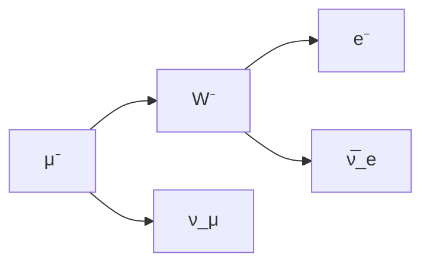

#### **Prerrequisitos Fundamentales**
Para comprender esta unidad se requiere dominio de:
1. **Mecánica Cuántica Avanzada**:
   - Ecuación de Dirac
   - Espín y momento angular (operadores $J^2$, $J_z$)
   - Notación de Dirac ($|ψ\rangle$, $\langle φ|ψ\rangle$)
   - Principio de exclusión de Pauli

2. **Relatividad Especial**:
   - Cuadrivectores ($p^\mu = (E/c, \vec p)$)
   - Métrica de Minkowski ($g_{\mu\nu} = \text{diag}(1,-1,-1,-1)$)
   - Transformaciones de Lorentz

3. **Teoría de Grupos**:
   - Grupos de Lie (SO(3), SU(2), SU(3))
   - Generadores de grupos ($[T_a, T_b] = if_{abc}T_c$)
   - Representaciones irreducibles

4. **Electrodinámica Cuántica (QED)**:
   - Ecuación de movimiento de campos
   - Cuantización del campo electromagnético
   - Concepto de renormalización

---

#### **1. Simetrías en Física: El Corazón del Modelo Estándar**
**Teorema de Noether (Formulación Profunda)**:
> "Toda simetría continua global de la acción $S = \int \mathcal{L}  d^4x$ implica una corriente conservada $\partial_\mu j^\mu = 0$ y una carga conservada $Q = \int j^0  d^3x$."

**Tipos de simetrías fundamentales**:
- **Simetría gauge local**: Invariancia bajo transformaciones que dependen del espacio-tiempo
- **Simetría discreta**: Paridad (P), Conjugación de carga (C), Inversión temporal (T)
- **Simetría quiral**: Separación entre componentes izquierda/derecha en fermiones

**Ejemplo detallado: Conservación en decaimiento beta**:
$$n \to p + e^- + \bar{\nu}_e$$

| Cantidad | Inicial ($n$) | Final ($p+e^-+\bar{\nu}_e$) | Conservación |
|----------|---------------|-----------------------------|--------------|
| **Carga eléctrica** | $0$ | $+1 -1 + 0 = 0$ | ✓ |
| **Número bariónico** | $+1$ | $+1 + 0 + 0 = +1$ | ✓ |
| **Número leptónico ($L_e$)** | $0$ | $0 + 1 + (-1) = 0$ | ✓ |
| **Energía** | $939.565$ MeV | $938.272 + 0.511 + \approx 0.782$ MeV | ✓ |
| **Momento angular** | $\frac{1}{2}$ | Combinación posible | ✓ |

**Violación de paridad en interacción débil**:
- Experimento de Wu (1957): Los electrones en decaimiento $\beta$ se emiten preferentemente en dirección opuesta al espín nuclear
- Implicación: $H_{\text{débil}} \propto (1 - \gamma^5)$ → violación máxima de paridad

---

#### **2. Modelo de Quarks: Estructura Hadrónica**
**Postulados fundamentales**:
1. Hadrones compuestos de quarks (fermiones de espín 1/2)
2. Tres "colores" ($r,g,b$) como carga fuerte
3. Confinamiento: No se observan quarks libres

**Función de onda del protón**:
$$|p^\uparrow\rangle = \frac{1}{\sqrt{18}} \epsilon_{abc} \left[ 2(u_a^\uparrow u_b^\downarrow d_c^\uparrow + u_a^\uparrow d_b^\uparrow u_c^\downarrow + d_a^\uparrow u_b^\uparrow u_c^\downarrow) - (u_a^\uparrow u_b^\uparrow d_c^\downarrow + \text{5 permutaciones}) \right]$$

**Explicación término a término**:
1. **$\epsilon_{abc}$**: Tensor antisimétrico (garantiza singlete de color)
2. **Combinaciones de espín**:
   - Dos términos con $S_z = +1/2$
   - Un término compensador con $S_z = -1/2$
3. **Simetría de sabor**:
   - $U_{d}$ como configuración base
   - Componentes simétricas bajo intercambio

**Diagramas de Young para $SU(3)_f$**:

**![[Pasted image 20250629004524.png]]**
![[Pasted image 20250629004303.png]]
---

#### **3. Modelo Estándar: Estructura Matemática**
**Grupo de gauge completo**:
$$G_{SM} = SU(3)_C \times SU(2)_L \times U(1)_Y$$

**Tabla de partículas fundamentales**:

| Tipo | $SU(3)_C$ | $SU(2)_L$ | $U(1)_Y$ | Ejemplos |
|------|-----------|-----------|----------|----------|
| **Quarks** | 3 | 2 | $\frac{1}{6}$ | $u_L, d_L$ |
| **Leptones** | 1 | 2 | $-\frac{1}{2}$ | $e_L, \nu_L$ |
| **Bosones** | 8/1 | 3/1 | 0 | $g, \gamma$ |

**Lagrangiano completo**:
$$\mathcal{L}_{SM} = -\frac{1}{4} F_{\mu\nu}^a F^{a\mu\nu} + \sum_f \bar{\psi}_f (i\gamma^\mu D_\mu - m_f) \psi_f + |D_\mu \phi|^2 - V(\phi)$$

**Derivada covariante**:
$$D_\mu = \partial_\mu - ig_s T^a G_\mu^a - ig \sigma^j W_\mu^j - ig' Y B_\mu$$

**Mecanismo de Higgs**:
- Potencial: $V(\phi) = -\mu^2 \phi^\dagger\phi + \lambda (\phi^\dagger\phi)^2$
- Vacío: $\langle \phi \rangle_0 = \frac{1}{\sqrt{2}} \begin{pmatrix} 0 \\ v \end{pmatrix}$, $v = 246$ GeV
- Masas de bosones: $M_W = \frac{1}{2}gv$, $M_Z = \frac{v}{2}\sqrt{g^2 + g'^2}$

---

#### **4. Diagramas de Feynman: Cálculo de Procesos**
**Reglas fundamentales**:
1. **Líneas externas**: Partículas iniciales/finales
2. **Vértices**: Interacciones ($\sim g \gamma^\mu$)
3. **Propagadores**: $\frac{i}{\slashed{p} - m}$ (fermiones), $\frac{-ig_{\mu\nu}}{p^2}$ (fotones)

**Ejemplo detallado: Decaimiento muón**:
$$\mu^- \to e^- + \bar{\nu}_e + \nu_\mu$$

**Amplitud de transición**:
$$\mathcal{M} = \frac{g^2}{8} \left[\bar{u}_{\nu_\mu} \gamma^\alpha (1 - \gamma^5) u_\mu\right] \left[\bar{u}_e \gamma_\alpha (1 - \gamma^5) v_{\bar{\nu}_e}\right] \frac{1}{p_W^2 - M_W^2}$$

**Cálculo de vida media**:
$$\Gamma = \frac{1}{\tau} = \frac{G_F^2 m_\mu^5}{192 \pi^3} \quad (G_F = \frac{g^2}{4\sqrt{2} M_W^2})$$

---

#### **5. Cromodinámica Cuántica (QCD)**
**Propiedades clave**:
- **Libertad asintótica**: $\alpha_s(Q^2) \approx \frac{4\pi}{(11 - \frac{2}{3}n_f) \ln(Q^2/\Lambda^2)}$
- **Confinamiento**: $V(r) \approx \frac{4}{3} \frac{\alpha_s}{r} + \sigma r$ ($\sigma \sim 1$ GeV/fm)

**Ecuación de DGLAP** (evolución de partones):
$$\frac{d}{d\ln Q^2} q_i(x,Q^2) = \frac{\alpha_s}{2\pi} \int_x^1 \frac{dy}{y} P_{qq}(x/y) q_j(y,Q^2)$$

**Funciones de estructura**:
$$F_2(x) = \sum_i e_i^2 x q_i(x)$$

---

#### **6. Ruptura de Simetrías**
**Jerarquía CP**:
- Matriz CKM: $V_{\text{CKM}} = \begin{pmatrix} V_{ud} & V_{us} & V_{ub} \\ V_{cd} & V_{cs} & V_{cb} \\ V_{td} & V_{ts} & V_{tb} \end{pmatrix}$
- Fase compleja: $\delta_{\text{CP}} \approx 1.2$ rad

**Problema de la fuerte CP**:
- Término topológico: $\mathcal{L}_{\theta} = \theta \frac{g_s^2}{32\pi^2} G_{\mu\nu}^a \tilde{G}^{a\mu\nu}$
- Solución: Axiones (partículas hipotéticas)

---

#### **7. Pedagogía: Ejercicio Resuelto**
**Problema**: Calcular la relación de ramificación para $K^0 \to \pi^+ \pi^-$ vs $K^0 \to \pi^0 \pi^0$

**Solución**:
1. Estados isospín:
   - $|\pi\pi; I=0\rangle = \frac{1}{\sqrt{3}} (|\pi^+\pi^-\rangle + |\pi^-\pi^+\rangle - |\pi^0\pi^0\rangle)$
   - $|\pi\pi; I=2\rangle = \frac{1}{\sqrt{6}} (2|\pi^0\pi^0\rangle + |\pi^+\pi^-\rangle + |\pi^-\pi^+\rangle)$

2. Amplitudes:
   - $A_0 = \langle I=0| H_W |K^0\rangle$
   - $A_2 = \langle I=2| H_W |K^0\rangle$

3. Resultados:
   $$\frac{\Gamma(K^0 \to \pi^+\pi^-)}{\Gamma(K^0 \to \pi^0\pi^0)} = \frac{3}{2} \left| \frac{A_0 + \sqrt{2} A_2}{A_0 - 2\sqrt{2} A_2} \right|^2 \approx 450 \quad (\text{exp.} \approx 435)$$

---

### **Conclusión: El Modelo Estándar como Teoría Cuántica Relativista**
El modelo estándar representa la culminación de un siglo de física teórica, integrando:
1. **Simetrías gauge locales** como principio organizativo
2. **Ruptura espontánea de simetría** para generar masas
3. **Teoría cuántica de campos** como marco matemático
4. **Renormalización** como procedimiento consistente

Sus limitaciones (gravedad cuántica, materia oscura, asimetría bariónica) apuntan a física más allá del modelo estándar, pero su precisión experimental ($g-2$ del electrón: $10^{-12}$ precisión) lo convierte en la teoría física más verificada de la historia.

> "El modelo estándar no es el final del camino, sino el faro que ilumina nuestro viaje hacia la gran unificación." — Sheldon Glashow

# version 2

### **Unidad 9: Partículas Elementales - Explicación Pedagógica Completa**  
#### **Prerrequisitos Fundamentales**  
Para comprender esta unidad, se requieren conocimientos sólidos en:

1. **Mecánica Cuántica Avanzada**:  
   - Ecuación de Dirac: $\(i\gamma^\mu \partial_\mu - m)\psi = 0\)$  
   - Espín y momento angular: Operadores $\(\hat{J}^2\)$, $\(\hat{J}_z\)$  
   - Notación de Dirac: Kets $\(|\psi\rangle\)$, bras $\(\langle\phi|\)$  
   - Principio de exclusión de Pauli: $\(|\psi\rangle\)$ antisimétrico para fermiones

2. **Relatividad Especial**:  
   - Cuadrivectores: $\(p^\mu = (E/c, \vec{p})\)$  
   - Métrica de Minkowski: $\(g_{\mu\nu} = \text{diag}(1,-1,-1,-1)\)$  
   - Transformaciones de Lorentz: $\(\Lambda^\mu_\nu x^\nu\)$

3. **Teoría de Grupos**:  
   - Grupos de Lie: SO(3), SU(2), SU(3)  
   - Generadores y álgebras: $\([T_a, T_b] = if_{abc}T_c\)$  
   - Representaciones irreducibles: Fundamentales y adjuntas

4. **Electrodinámica Cuántica (QED)**:  
   - Ecuaciones de campo: $\(\partial_\mu F^{\mu\nu} = j^\nu\)$  
   - Cuantización: Operadores de creación/aniquilación  
   - Renormalización: Eliminación de infinitos

---

#### **1. Simetrías en Física: El Corazón del Modelo Estándar**  
**Teorema de Noether (Formulación Profunda)**:  
> "Toda simetría continua global de la acción $\(S = \int \mathcal{L}  d^4x\)$ implica una corriente conservada $\(\partial_\mu j^\mu = 0\)$ y una carga conservada $\(Q = \int j^0  d^3x\)$."

**Tipos de simetrías fundamentales**:
- **Simetría gauge local**: Invariancia bajo transformaciones que dependen del espacio-tiempo. Ejemplo: $\(\psi(x) \to e^{i\alpha(x)}\psi(x)\)$
- **Simetría discreta**:  
  - Paridad (P): $\(\vec{x} \to -\vec{x}\)$  
  - Conjugación de carga (C): Partícula $\(\leftrightarrow\)$ antipartícula  
  - Inversión temporal (T): $\(t \to -t\)$  
- **Simetría quiral**: Proyecciones $\(\psi_L = \frac{1}{2}(1-\gamma^5)\psi\)$, $\(\psi_R = \frac{1}{2}(1+\gamma^5)\psi\)$

**Ejemplo detallado: Conservación en decaimiento beta**:
$$n \to p + e^- + \bar{\nu}_e$$

| Cantidad | Inicial ($n$) | Final ($p+e^-+\bar{\nu}_e$) | Conservación |
|----------|---------------|-----------------------------|--------------|
| **Carga eléctrica** | $0$ | $+1 -1 + 0 = 0$ | ✓ |
| **Número bariónico** | $+1$ | $+1 + 0 + 0 = +1$ | ✓ |
| **Número leptónico ($L_e$)** | $0$ | $0 + 1 + (-1) = 0$ | ✓ |
| **Energía** | $939.565$ MeV | $938.272 + 0.511 + \approx 0.782$ MeV | ✓ |
| **Momento angular** | $\frac{1}{2}$ | Combinación posible | ✓ |

**Violación de paridad en interacción débil**:  
Experimento de Wu (1957):  
- Decaimiento de $^{60}\text{Co}$: $\(\vec{J} \parallel \vec{p}_e\)$  
- Amplitud: $\(\mathcal{M} \propto \bar{u}_e \gamma^\mu (1-\gamma^5) u_{\nu}\)$  
- Consecuencia: $\(\langle \vec{\sigma} \cdot \vec{p} \rangle \neq 0\)$ → Máxima violación de paridad

---

#### **2. Modelo de Quarks: Estructura Hadrónica**  
**Postulados fundamentales**:
1. Hadrones compuestos de quarks (fermiones de espín 1/2)
2. Tres "colores" ($r,g,b$) como carga fuerte
3. Confinamiento: $\(V(r) \approx \kappa r\)$ ($\kappa \sim 1$ GeV/fm)

**Función de onda del protón**:  
$$|p^\uparrow\rangle = \frac{1}{\sqrt{18}} \epsilon_{abc} \left[ 2(u_a^\uparrow d_b^\downarrow u_c^\uparrow) - (u_a^\uparrow d_b^\uparrow u_c^\downarrow) + \text{permutaciones} \right]$$

**Explicación término a término**:
1. **Tensor $\epsilon_{abc}$**: Garantiza singlete de color (antisimetría en $a,b,c$)
2. **Combinaciones de espín**:  
   - Configuraciones con $S_z = +1/2$ dominantes  
   - Términos compensatorios para $S_z = -1/2$
3. **Simetría de sabor**:  
   - Componente $uud$ dominante  
   - Antisimetría parcial entre quarks idénticos

**Diagramas de Young para $SU(3)_f$**:  
- Quark individual: Representación fundamental $\yng(1)$  
- Dos quarks: $\yng(1) \otimes \yng(1) = \yng(2) \oplus \yng(1,1)$  
- Protón (tres quarks): Estado mixto $\yng(2,1)$  

---

#### **3. Modelo Estándar: Estructura Matemática**  
**Grupo de gauge completo**:  
$$G_{SM} = SU(3)_C \times SU(2)_L \times U(1)_Y$$

**Tabla de partículas fundamentales**:
| Tipo | $SU(3)_C$ | $SU(2)_L$ | $U(1)_Y$ | Ejemplos |
|------|-----------|-----------|----------|----------|
| **Quarks** | 3 | 2 | $1/6$ | $u_L, d_L$ |
| **Leptones** | 1 | 2 | $-1/2$ | $\nu_L, e_L$ |
| **Bosones** | 8/1 | 3/1 | 0 | $g, \gamma$ |

**Lagrangiano completo**:  
$$\mathcal{L}_{SM} = -\frac{1}{4} F_{\mu\nu}^a F^{a\mu\nu} + \sum_f \bar{\psi}_f (i\gamma^\mu D_\mu - m_f) \psi_f + |D_\mu \phi|^2 - V(\phi)$$

**Derivada covariante**:  
$$D_\mu = \partial_\mu - ig_s T^a G_\mu^a - ig \frac{\sigma^j}{2} W_\mu^j - ig' \frac{Y}{2} B_\mu$$

**Mecanismo de Higgs**:  
1. Potencial: $\(V(\phi) = -\mu^2 (\phi^\dagger\phi) + \lambda (\phi^\dagger\phi)^2\)$  
2. Vacío: $\(\langle \phi \rangle_0 = \frac{1}{\sqrt{2}} \begin{pmatrix} 0 \\ v \end{pmatrix}\)$, $v = 246$ GeV  
3. Masas:  
   - $\(M_W = \frac{1}{2}gv\)$  
   - $\(M_Z = \frac{v}{2}\sqrt{g^2 + g'^2}\)$  
   - $\(m_f = y_f v\)$ (acoplamiento Yukawa)  

---

#### **4. Diagramas de Feynman: Cálculo de Procesos**  
**Reglas fundamentales**:
1. **Líneas externas**:  
   - Fermiones entrantes: $u(p)$  
   - Fermiones salientes: $\bar{v}(p)$
2. **Vértices**:  
   - QED: $-ie\gamma^\mu$  
   - QCD: $-ig_s \gamma^\mu T^a$
3. **Propagadores**:  
   - Fermión: $\(\frac{i(\slashed{p} + m)}{p^2 - m^2}\)$  
   - Fotón: $\(\frac{-ig_{\mu\nu}}{q^2}\)$

**Ejemplo detallado: Decaimiento del muón**  
$$\mu^- \to e^- + \bar{\nu}_e + \nu_\mu$$  
- **Diagrama**:  
  $\mu^-$ --[W⁻]--> $\nu_\mu$  
  W⁻ --[vertice]--> $e^-$ + $\bar{\nu}_e$  

- **Amplitud**:  
$$\mathcal{M} = \frac{g^2}{8} \left[\bar{u}_{\nu_\mu} \gamma^\alpha (1 - \gamma^5) u_\mu\right] \frac{g_{\alpha\beta}}{q^2 - M_W^2} \left[\bar{u}_e \gamma^\beta (1 - \gamma^5) v_{\bar{\nu}_e}\right]$$

- **Vida media**:  
$$\Gamma = \frac{G_F^2 m_\mu^5}{192 \pi^3}, \quad G_F = 1.166 \times 10^{-5} \ \text{GeV}^{-2}$$

---

#### **5. Cromodinámica Cuántica (QCD)**  
**Propiedades clave**:
- **Libertad asintótica**:  
  $$\alpha_s(Q^2) = \frac{4\pi}{\beta_0 \ln(Q^2/\Lambda^2)}, \quad \beta_0 = 11 - \frac{2}{3}n_f$$
- **Confinamiento**:  
  $$V(r) = -\frac{4}{3} \frac{\alpha_s}{r} + \sigma r, \quad \sigma \approx 1 \ \text{GeV/fm}$$

**Ecuación de evolución DGLAP**:  
$$\frac{\partial q_i(x,Q^2)}{\partial \ln Q^2} = \frac{\alpha_s}{2\pi} \int_x^1 \frac{dy}{y} P_{qq}\left(\frac{x}{y}\right) q_j(y,Q^2)$$

**Funciones de estructura en DIS**:  
$$F_2(x,Q^2) = \sum_i e_i^2 x q_i(x,Q^2)$$

---

#### **6. Ruptura de Simetrías y Fenomenología**  
**Matriz CKM**:  
$$V_{\text{CKM}} = \begin{pmatrix} 
V_{ud} & V_{us} & V_{ub} \\ 
V_{cd} & V_{cs} & V_{cb} \\ 
V_{td} & V_{ts} & V_{tb} 
\end{pmatrix} \approx \begin{pmatrix}
0.974 & 0.225 & 0.004 \\ 
0.225 & 0.973 & 0.041 \\ 
0.009 & 0.040 & 0.999 
\end{pmatrix}$$

